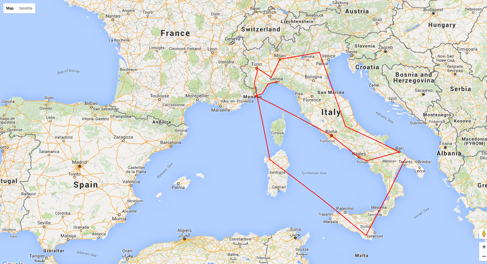
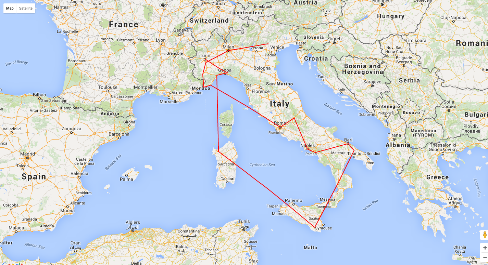
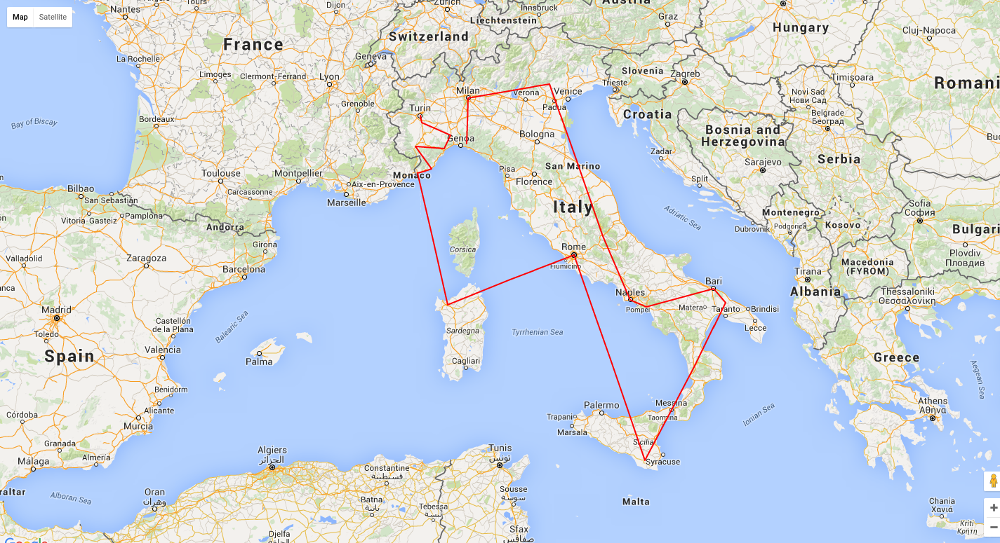

# TSP resolved with a genetic algorithm

This project is related to
[https://github.com/wdalmut/tsp-genetic-algorithm](https://github.com/wdalmut/tsp-genetic-algorithm)

This project is related to
[https://github.com/wdalmut/tsp-genetic-algorithm-2](https://github.com/wdalmut/tsp-genetic-algorithm-2)

This solution try to solve the tsp using a genetic algorithm.

In this solution i try to optmize the best solution found using only mutations
for a given number of successive generations

